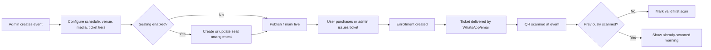
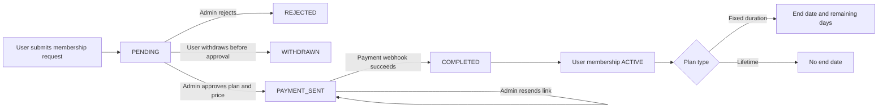
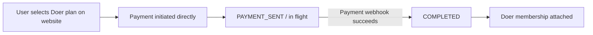
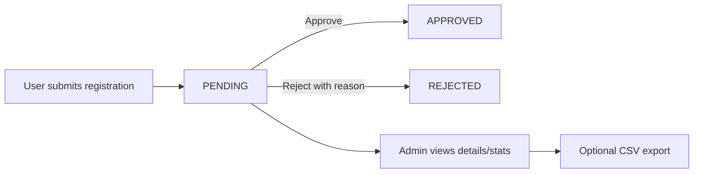
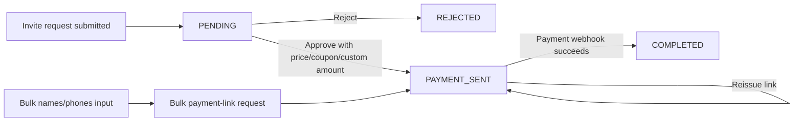
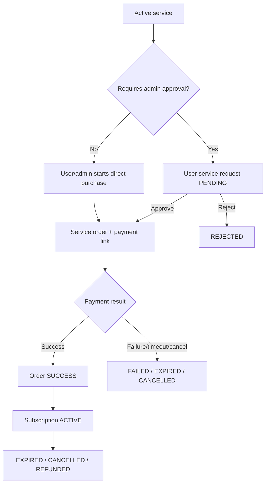
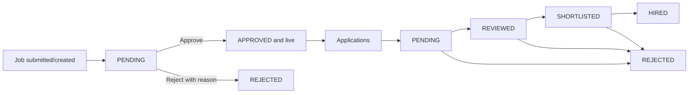
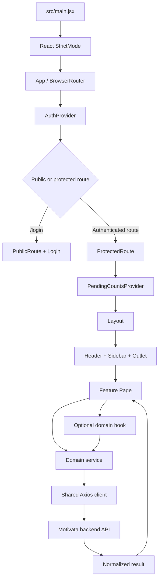

# Motivata Admin Frontend — Developer Handoff

> Repository: `motivata-admin-frontend`\
> Analyzed branch: `main`\
> Analyzed commit: `084dd29` (`084dd29c90f175ad76f663544a9835502af1f754`)\
> Commit date: 2026-09-27\
> Report date: 2026-09-28\
> Updated: 2026-09-28 for the release-preparation changes (Node pin, `.env.example`, `/test-services` gating, dependency security update, lint baseline). See §7.4.

## 1. Executive summary

This repository is the internal administration SPA for the Motivata platform. It supports the operational lifecycle around events and tickets, membership and Doer plans, paid services, clubs and community content, engagement programs, registration queues, jobs, referrals, users, administrators, and feature gating.

The application is a React 19/Vite 7 JavaScript project styled with Tailwind CSS 4. It uses React Router for client-side navigation, Axios for most backend communication, React Context for authentication and pending-request counts, and page-specific hooks/services for domain state. It is designed as a single-page application and is configured for Vercel history fallback.

The codebase is feature-rich but currently has a thin onboarding and quality-safety layer:

- The checked-in `README.md` is still the stock Vite README.
- `.env.example`, a `package.json` `engines` range, and `.nvmrc` are committed. There is still no automated test suite or CI workflow.
- `npm ci`, `npm run lint` (0 errors; existing debt is reported as warnings), and `npm run build` pass on Node 24.
- Authorization is mostly implemented by hiding page actions; all routes share one authentication-only guard. Backend authorization is therefore critical.
- Two routes are absent from the sidebar: `/payments` and `/test-services`. The latter creates real backend records, so production builds exclude it unless `VITE_ENABLE_TEST_SERVICES=true`.

## 2. Repository snapshot

| Item | Current state |
| --- | --- |
| Application type | Browser-based admin SPA |
| Language | JavaScript and JSX; no TypeScript |
| UI framework | React `19.2.0` |
| Build/dev server | Vite `7.3.6` (resolved in `package-lock.json`) |
| Styling | Tailwind CSS `4.1.17` through `@tailwindcss/vite` |
| Routing | `react-router-dom` `7.18.4` using declarative routes |
| HTTP | Axios `1.20.0`, plus direct `fetch` in two pages |
| Notifications | `react-toastify` |
| Icons | `lucide-react` and `react-icons` |
| Charts/motion | Recharts and Framer Motion |
| QR scanning | `html5-qrcode` |
| Deployment config | Vercel SPA rewrite in `vercel.json`; see §8 for the observed live host |
| Production API configuration | Required `VITE_API_BASE_URL`; production value `https://motivata.synquic.com/api` |
| Source size | Approximately 65,785 lines under `src/` |
| Feature surface | 49 page files, 48 service files, 19 hooks, 105 components |
| Tests | No test/spec files found |
| CI | No `.github/workflows` configuration found |
| Build artifacts | `dist/` is committed and currently about 2.4 MB |
| Existing docs | 17 integration/reference Markdown files under `docs/` |

Vite 7 requires Node `^20.19.0 || >=22.12.0`. `package.json` declares `engines` as `^20.19.0 || ^22.12.0 || ^24.0.0`, and `.nvmrc` pins Node 24.

## 3. What the product does

The panel is a back-office control surface. Most pages follow one of four operational patterns:

1. **Catalog management:** administrators create, edit, activate, order, restore, or remove entities such as events, services, membership plans, sessions, challenges, polls, vouchers, and content.
2. **Request review:** users submit requests; administrators inspect, approve, reject, and sometimes generate or resend payment links.
3. **Transaction operations:** administrators create cash/direct tickets, generate payment links, track orders/subscriptions, scan tickets, redeem rewards, and resend delivery messages.
4. **Moderation and access control:** administrators manage clubs, posts, jobs, memberships, staff access, app versions, and feature gates.

### 3.1 Functional area map

| Area | Routes | Business purpose |
| --- | --- | --- |
| Authentication and analytics | `/login`, `/dashboard` | Admin sign-in and business/operational overview |
| Events | `/events`, `/enrollments`, `/event-requests` | Event catalog, ticket tiers/seating/media, attendee enrollments, invite approvals and payment links |
| Ticket operations | `/cash-tickets`, `/scan-qr`, `/ticket-reshare` | Offline/direct issuance, bulk import, QR validation, reward redemption, ticket delivery/re-delivery |
| Promotions | `/coupons`, `/vouchers` | Discount/coupon and voucher management |
| Users and administrators | `/users`, `/admins` | User lifecycle, administrator accounts, roles, access flags, allowed events, cash-ticket limits |
| Memberships | `/memberships`, `/membership-requests`, `/doer-requests` | Plans, user memberships, membership approvals, direct Doer purchases, payment-link tracking |
| Feature policy | `/feature-access` | Enable/disable selected app features and require Membership/Doer access |
| Paid services | `/services`, `/service-requests`, `/service-orders`, `/user-subscriptions` | Service catalog, approval flow, payment links/orders, activated subscriptions |
| Registration programs | `/motivata-blend-requests`, `/round-table-requests`, `/motivata-blend-banner` | Review program registrations and manage the Blend banner |
| Clubs and community | `/clubs`, `/club-join-requests`, `/admin-club-posts`, `/explore-posts`, `/community`, `/occupations` | Clubs, membership approval, roles, posts, Explore content, weekly updates/help moderation, occupation taxonomy |
| Engagement | `/sessions`, `/quizes`, `/sos-articles`, `/daily-sos`, `/qol-factors`, `/challenges`, `/daily-challenges`, `/challenge-rewards`, `/polls`, `/stories`, `/recommendations` | Sessions/bookings, SOS and quiz content, challenges/rewards, polls, ephemeral stories, recommendations |
| Careers | `/job-posts`, `/job-applications`, `/opportunity-filters` | Job moderation, candidate pipeline, filter taxonomies |
| Student referrals | `/colleges`, `/leaders`, `/referral-codes` | College/leader directory and referral-code issuance/validation |
| Settings | `/settings` | Mobile app version and update policy |
| Orphan/utility routes | `/payments`, `/test-services` | Placeholder payment page and a live service-flow data creation utility (development/opt-in builds only) |

Keep the existing spelling `/quizes` unless coordinating a frontend/backend/link migration; the misspelling is part of the current route and API contract.

## 4. Business flows

### 4.1 Admin sign-in and access

1. The administrator signs in with username and password.
2. The backend returns an admin profile plus access and refresh tokens.
3. The profile contains a role, status, optional access flags, and optional allowed-event restrictions.
4. The frontend loads the protected layout and begins polling pending-request badge counts.
5. Page-level actions are shown or hidden based mostly on role.

Roles represented in the UI:

- `SUPER_ADMIN`: intended to have unrestricted access; can permanently delete events.
- `ADMIN`: can manage most catalogs and operational flows.
- `MANAGEMENT_STAFF`: can be constrained by access flags, allowed events, and a maximum cash-ticket allowance.

Administrator statuses are `ACTIVATED` and `DEACTIVATED`. Configurable access flags currently exposed by the admin form are `events`, `enrollments`, `payments`, `users`, and `coupons`.

Important: those access flags are not currently wired into the route tree, and `ProtectedRoute` is not passed role/access requirements by `App.jsx`. Treat backend authorization as the source of truth until frontend route/sidebar policy is implemented consistently.

### 4.2 Event publishing and ticket lifecycle



Operational details:

- Events support CRUD, soft deletion, restoration, permanent deletion, featured/live state, expiry updates, ticket statistics, media, multiple pricing tiers, and optional seating arrangements.
- Enrollments aggregate one or more tickets and can be `ACTIVE`, `CANCELLED`, `REFUNDED`, or mixed at the display level.
- Cash-ticket operations can create a redemption link, issue a direct ticket, or bulk-issue tickets from a spreadsheet.
- Ticket reshare supports individual or bulk delivery through WhatsApp, email, or both.
- The QR page first tests the regular-ticket endpoint, falls back to the cash-ticket endpoint on `404`, detects already-scanned tickets, and also recognizes/redeems challenge reward codes.
- Event requests can generate a payment link after admin approval, reissue a link, or send links in bulk.

### 4.3 Membership request and payment flow



Business notes:

- Membership plans and actual user memberships are managed separately from incoming requests.
- Admin approval can select a plan, set an amount, apply a coupon, choose contact preferences, and send a payment link.
- The payment provider/webhook is responsible for moving payment-link requests to completion and attaching the membership.
- Membership operators can create a membership directly, check status by phone, extend, cancel, add notes, and manage plan lifecycle.
- Existing documentation describes lifetime plans as `durationInDays` equal to `0` or an absent end date; verify the exact backend contract before modifying this behavior.

### 4.4 Doer purchase flow

Doer purchases use a parallel service and route namespace but reuse the membership request queue UI.



The page explicitly treats Doer rows as purchase records rather than approval work. The shared UI can technically show approve/reject controls for a `PENDING` record, and the service still exposes those endpoints, but normal Doer records are expected to bypass that state.

### 4.5 Motivata Blend and Round Table registration

Both features follow the same review shape:



Each queue has list/detail/stats/export endpoints and a 30-second pending badge in the sidebar. `MotivataBlendBanner` separately controls the promotional banner seen by users.

### 4.6 Event invite request flow



The bulk operation has a client timeout of 180 seconds, unlike the standard 30-second Axios timeout.

### 4.7 Services, orders, and subscriptions

Services support two commercial models:



- The catalog controls category, duration, price, display order, feature state, and approval requirements.
- Admins can create orders/payment links directly for one or more services and resend links.
- Approval can record alternate contact details and notification preferences.
- Subscription operators can inspect status, cancel, and maintain internal notes.

### 4.8 Clubs and community moderation

- Admins create/update/delete clubs, inspect statistics, view members, and change member roles.
- A club may require join approval. Requests move from `PENDING` to `APPROVED` or `REJECTED`; rejection includes a reason and optional admin notes.
- Club posting permission settings determine who can post; the repository contains supporting permission badges and selectors.
- Admins can create club posts with image/video media and moderate club posts.
- Explore posts are a separate curated content stream with categories.
- Community moderation handles weekly updates and help requests; help requests can be resolved or deleted.
- Occupations are managed as a hierarchical taxonomy for user profiles/opportunity matching.

### 4.9 Jobs and candidate pipeline



Opportunity filters are separately managed under Type, Duration, Timeline, and Location categories.

### 4.10 Engagement and content operations

- **Sessions:** catalog plus booking lifecycle and live/status controls.
- **Quizes:** standard quizzes and SOS program quizzes; IDs for questions/options matter during editing.
- **SOS:** program articles, scheduled daily questions, and quality-of-life factors.
- **Challenges:** challenge templates, categories/icons, daily challenge scheduling/bulk scheduling, and redeemable rewards.
- **Polls:** event-aware polls, activation, result statistics, and deleted-item handling.
- **Stories:** image/video stories with TTL, ordering, activation, expiration, statistics, soft/permanent deletion.
- **Recommendations:** curated, taggable recommendations.

### 4.11 Feature access policy

The Feature Access page manages at least `SOS`, `SOS_INTENSIVE`, `CONNECT`, and `CHALLENGE`. Each feature has two independent controls:

- `isActive`: whether the feature is enabled for anyone.
- `requiresMembership`: whether access requires an active Membership, Doer plan, or individual feature purchase.

The page states that updates apply immediately, so changes should be treated as production-impacting configuration.

### 4.12 Student referral flow

Colleges and leaders are managed as reference data. Referral codes can be created, updated, deleted, scoped to a college/leader, and validated. This supports acquisition attribution and referral-based plan behavior.

## 5. Technical architecture and runtime flow

### 5.1 High-level component/data flow



### 5.2 Boot and route lifecycle

1. `src/main.jsx` mounts `<App />` inside React `StrictMode`.
2. `App.jsx` installs `BrowserRouter`, `AuthProvider`, all routes, and the global `ToastContainer`.
3. `AuthProvider` checks stored tokens and calls `/web/auth/profile` to validate and refresh admin data.
4. `PublicRoute` redirects authenticated users away from `/login`.
5. One outer `ProtectedRoute` wraps every admin route. It currently checks authentication only because no route passes `allowedRoles` or `requiredAccess`.
6. `PendingCountsProvider` polls five request-count services every 30 seconds while the tab is visible and stops when hidden.
7. `Layout` renders a responsive sidebar/header and the nested page through `<Outlet />`.

The pending-count source keys are membership, Doer, Motivata Blend, Round Table, and Event Requests. A comment still describes four sources and should be updated.

### 5.3 Authentication and token refresh

The backend login response is expected to resemble:

```text
data: {
  admin: { ...profile, role, access, allowedEvents, ... },
  tokens: { accessToken, refreshToken }
}
```

Storage behavior:

- With **Remember me**, tokens and admin data use `localStorage`.
- Without it, tokens and admin data use `sessionStorage`.
- The `rememberMe` selector itself is always stored in `localStorage`.
- Logout calls `/web/auth/logout` and clears both storage locations even if the server call fails.

The shared Axios request interceptor attaches `Authorization: Bearer <access token>`. On an eligible `401`:

1. The first failed request calls `/web/auth/refresh-token` with the refresh token.
2. Other simultaneous failed requests enter an in-memory queue.
3. A successful refresh updates the access token, releases the queue, and retries requests.
4. A missing/failed refresh clears auth storage and assigns `window.location.href = '/login'`.

This avoids a refresh stampede but forces a full-page navigation when the session is unrecoverable.

### 5.4 API base URL and response contract

`src/services/api.service.js` defines the shared client:

- `VITE_API_BASE_URL` is mandatory in production.
- Development fallback: `http://localhost:5000/api`.
- Default timeout: 30 seconds.
- Default content type: JSON.
- `API_ORIGIN` removes a trailing `/api` and is used to resolve relative asset paths.

Most services return a normalized object through `handleApiResponse`:

```text
{
  success: boolean,
  data: any | null,
  message: string,
  error: string | null,
  status: number
}
```

Pages should check `result.success` before reading domain payloads. Backend data is generally expected under `response.data.data`.

Two pages bypass the shared client:

- `ScanQR.jsx` uses direct `fetch` for regular and cash ticket validation.
- `TestServices.jsx` uses direct `fetch` to create service test data.

Those calls manually attach the token and do not receive shared timeout, response normalization, or automatic refresh behavior.

### 5.5 Page, hook, and service responsibilities

The most mature features use a three-layer pattern:

```text
Page
  owns modal visibility, selected record, permission-driven actions, layout
    -> Hook
       owns list state, filters, pagination, loading/error, CRUD orchestration
         -> Service
            owns endpoint paths, query serialization, HTTP verbs
              -> api.service.js
                 owns auth headers, refresh, base URL, normalization
```

Examples include events, services, service orders/requests, subscriptions, users, stories, sessions, vouchers, challenges, quizzes, and ticket reshare.

Several newer/smaller pages call services directly and own all list/form state locally. Both patterns are valid in the current codebase, but new complex list pages should prefer a hook to keep components manageable.

### 5.6 Pagination and filters

Pagination contracts are not uniform. Common shapes include:

- `{ currentPage, totalPages, totalCount, limit, hasNextPage, hasPrevPage }`
- `{ page, totalPages, total, limit }`

The shared `Pagination` component expects `currentPage`, `totalPages`, `totalItems`, and `itemsPerPage`, so hooks/pages frequently adapt backend shapes. Preserve each endpoint's exact shape or normalize it at the service boundary before generalizing pagination code.

Many hooks implement search debounce with a `useRef` timer. Some pages issue a request on every search change. Review backend load implications when adding filters.

### 5.7 Uploads and media

`asset.service.js` uploads multipart files to `/web/assets/upload`, supports progress callbacks, validates MIME type and size, and returns public/download URLs. `FileUpload.jsx` provides drag/drop, preview, multiple-file support, progress, and an optional manual URL path.

Domain-specific upload paths also exist for clubs, the Motivata Blend banner, offline ticket spreadsheets, and job images. Avoid setting the global Axios `Content-Type` manually for `FormData` outside established patterns; let the request preserve its multipart boundary.

### 5.8 UI system

Reusable primitives live in `src/components/ui/`:

- `Button`, `Badge`, `Card`, `StatCard`
- `Modal`, `ConfirmDialog`
- `Table`, `Pagination`
- `FileUpload`
- `EventSingleSelect`, `EventMultiSelect`
- `CopyLinkButton`

The design language is Tailwind-based, responsive, gray/white with semantic status colors, rounded cards, and mobile card fallbacks for tables. `index.css` defines custom scrollbars, base typography, glass utilities, skeleton states, and small animations.

The generic `Modal` handles Escape and body-scroll locking but does not implement focus trapping or focus restoration. Treat that as an accessibility improvement opportunity.

### 5.9 Production logging behavior

The Vite config marks `console.log`, `console.info`, and `console.debug` as pure so minification removes them from production builds. `console.warn` and `console.error` remain. This matters because development logging is extensive, particularly in QR scanning and API services.

Request logging masks passwords and token fields in structured request/response objects. Continue to avoid logging phone numbers, QR payloads, payment links, or full user records in warnings/errors, because those methods remain in production.

## 6. Directory guide

```text
motivata-admin-frontend/
├── src/
│   ├── main.jsx                 # React entry point
│   ├── App.jsx                  # Providers and complete route tree
│   ├── index.css                # Tailwind import and global utilities
│   ├── assets/                  # Logos and bundled image assets
│   ├── components/
│   │   ├── ui/                  # Shared primitives
│   │   ├── analytics/           # Dashboard widgets
│   │   └── <domain>/            # Forms, tables, filters, and modals
│   ├── contexts/
│   │   ├── AuthContext.jsx      # Session/profile/role helpers
│   │   └── PendingCountsContext.jsx
│   ├── hooks/                   # Domain list/CRUD orchestration
│   ├── pages/                   # Route-level screens
│   ├── services/                # Endpoint and HTTP layer
│   └── utils/                   # Storage, status, product-link helpers
├── docs/                        # Historical and feature integration notes
├── public/                      # Static favicon and Vite asset
├── dist/                        # Committed production build output
├── package.json
├── package-lock.json
├── vite.config.js
├── vercel.json
└── eslint.config.js
```

Useful starting points:

- Routing/provider setup: `src/App.jsx`
- Authentication lifecycle: `src/contexts/AuthContext.jsx`
- Token refresh and API normalization: `src/services/api.service.js`
- Main navigation: `src/components/Sidebar.jsx`
- Role/access fields: `src/components/admin/AdminForm.jsx`
- Shared request queue: `src/components/membershipRequests/RequestQueuePage.jsx`
- Feature access behavior: `src/pages/FeatureAccess.jsx`
- Most complex operational page: `src/pages/ScanQR.jsx`

## 7. Local setup

### 7.1 Prerequisites

- Node 24 (`.nvmrc`); `engines` also accepts `^20.19.0` and `^22.12.0`.
- npm with lockfile support.
- The Motivata backend available locally or through an accessible environment.
- An activated admin account.
- HTTPS when testing camera access on a non-localhost device.

### 7.2 Environment

Copy `.env.example` to an ignored local file such as `.env.local` and adjust it:

```dotenv
VITE_API_BASE_URL=http://localhost:5000/api
VITE_ENABLE_TEST_SERVICES=false
```

The value must include the API prefix expected by the backend. The production API is `https://motivata.synquic.com/api`. `npm run build` fails when `VITE_API_BASE_URL` is absent, and production startup also throws. `VITE_*` values are embedded in the client bundle, so they must never contain secrets.

### 7.3 Commands

```bash
npm ci
npm run dev
npm run lint
npm run build
npm run preview
```

The dev server listens on all interfaces (`host: true`) and defines a `/api` proxy to `http://localhost:5000`. The default API client fallback uses the absolute URL `http://localhost:5000/api`, so the proxy is only relevant when `VITE_API_BASE_URL` is configured as a relative `/api` base.

### 7.4 Validation status

Release-preparation verification, 2026-09-28, Node 24.21.0 / npm 11.19.0:

| Check | Result |
| --- | --- |
| Repository inspection | Completed at commit `084dd29` |
| `npm ci` | Pass; `npm audit` reports 0 vulnerabilities. The lockfile update resolved 19 advisories present at `084dd29`, including axios and react-router. |
| `npm run lint` | Pass: 0 errors, 229 warnings. These are pre-existing findings; the four React Compiler rules, `no-unused-vars`, and `react-refresh/only-export-components` report as warnings. |
| `npm run build` | Pass with the production `VITE_API_BASE_URL`; fails fast when it is unset |
| `/test-services` gating | Checked in WebKit against a mocked API: production builds omit it and redirect to `/dashboard`; it renders with `VITE_ENABLE_TEST_SERVICES=true` and under `npm run dev` |
| Build output | No sourcemaps, `console.log` calls, `localhost:5000` fallback, or secret patterns |
| Automated tests | None found |
| Static suspicious-code scan | No current `createRequire`, child-process execution, dynamic `Function`, or `eval` pattern found outside legitimate QR/base64 utilities |

After `npm ci`, the next developer should run lint and build before changing behavior and record any pre-existing failures separately from new work.

## 8. Deployment

`vercel.json` rewrites every path to `/`, allowing React Router deep links to load the SPA. Vercel must receive `VITE_API_BASE_URL` at build time.

Deployment checklist:

1. Set `VITE_API_BASE_URL` for Preview and Production.
2. Confirm the URL ends in the backend's expected `/api` prefix.
3. Build with an eligible Node version.
4. Smoke-test `/login`, an authenticated deep link, token refresh, media loading, and QR camera permissions.
5. Verify CORS for the deployed origin.
6. Confirm whether deployment builds from source or serves the committed `dist/` folder.

Observed on 2026-09-28: the live admin at `https://motivata.synquic.com` served a bundle byte-identical to the committed `dist/`, and most source-changing commits also regenerate `dist/`. Until a build-from-source pipeline is adopted, regenerate `dist/` with the production `VITE_API_BASE_URL` in every source-changing release.

`dist/` is tracked and recent history includes manual production-build updates. The team should choose one policy:

- build from source in CI/Vercel and stop committing `dist/`; or
- deliberately version `dist/` and require it to be regenerated in every source-changing release.

Mixing both risks shipping stale assets.

## 9. Existing documentation

The `docs/` directory contains detailed feature notes for membership requests, withdrawal/lifetime membership, alternative contact/payment handling, club approvals and posting permissions, coupons, service testing, UI components, feature access, and backend/mobile integration.

Use those files as implementation history and API examples, not automatically as canonical truth. Several are prompt-style integration documents and may predate later code. Confirm behavior against the current frontend service and backend controller before implementing changes.

The most immediately useful files are:

- `docs/UI_COMPONENTS_GUIDE.md`
- `docs/membership-request-api.md`
- `docs/ADMIN_FRONTEND_MEMBERSHIP_REQUEST_DOCS.md`
- `docs/MEMBERSHIP_WITHDRAW_AND_LIFETIME.md`
- `docs/TEST_SERVICES_GUIDE.md`
- `docs/CLUB_POSTING_PERMISSIONS_ADMIN_FRONTEND_PROMPT.md`
- `docs/frontend-admin-coupon-guide.md`

## 10. Confirmed risks and technical debt

### P1 — high priority

1. **`/test-services` performs real mutations**\
   It creates service records with predefined test data. Production builds now exclude the route and its code unless `VITE_ENABLE_TEST_SERVICES=true`; `npm run dev` always includes it. The route itself still has no role/access restriction, so enforce SUPER_ADMIN-only access on both frontend and backend before ever enabling it in a deployed build.

2. **Frontend permission model is incomplete**\
   `ProtectedRoute` supports `allowedRoles` and `requiredAccess`, but `App.jsx` applies neither. `hasAccess` is effectively unused for route enforcement. Page-level button hiding is inconsistent and is not a security boundary. Define a central route/menu permission map and ensure backend authorization mirrors it.

3. **No automated quality gate**\
   `npm ci`, lint, and build pass locally, but there are no tests or CI checks. Add a minimal CI workflow. Prioritize smoke tests for login/refresh, request approval, payment-link generation, and QR validation.

4. **Direct fetch calls bypass session recovery**\
   `ScanQR.jsx` and `TestServices.jsx` do not use the Axios refresh queue. If the access token has expired, a scan shows "Failed to validate ticket" (not a false valid result) until the session is refreshed; the layout's 30-second pending-count polling uses the shared client and refreshes it in the background. Move these operations behind services using the shared client, while preserving the QR endpoint's special response semantics.

5. **Security history deserves a dependency/supply-chain review**\
   Recent commits explicitly removed injected malicious code from Vite configuration and a `createRequire` shim. Current targeted scans did not find those patterns, but run `npm ci`, dependency audit/scanning, secret scanning, and a clean source build in CI before the next release.

### P2 — medium priority

1. **README is still the Vite boilerplate**\
   `.env.example`, `engines`, and `.nvmrc` now exist; replace the README with project-specific setup and deployment notes.

2. **Large components raise regression risk**\
   `ScanQR.jsx`, `Sessions.jsx`, `EventForm.jsx`, `Memberships.jsx`, `Clubs.jsx`, `Coupons.jsx`, and `Quizes.jsx` each exceed 1,100 lines. Extract domain hooks, schemas/validators, modal sections, and pure presentation components incrementally.

3. **Mixed state/data patterns**\
   Some pages use domain hooks, while others implement API, filters, forms, and modals in one file. Establish a convention for new work and normalize API/pagination shapes at the service or hook boundary.

4. **Navigation drift**\
   `/payments` and `/test-services` are absent from the sidebar. `/payments` is only a placeholder. `Layout.jsx` maintains a `routeToMenuId` map and passes `activeMenu`, but `Sidebar.jsx` ignores that prop and derives activity from `useLocation`; the map is dead code.

5. **Inconsistent destructive-action UX**\
   The codebase mixes `ConfirmDialog`, `window.confirm`, browser `alert`, inline errors, and toast messages. Standardize around accessible dialogs and toasts.

6. **Forgot-password link is nonfunctional**\
   Login renders `href="#"` without a reset flow. Remove it until implemented or connect it to a real recovery route.

7. **Accessibility gaps**\
   The shared modal lacks focus trapping/restoration. Some custom tables/actions need keyboard and screen-reader review. Global CSS removes default focus outlines and relies on components to provide alternatives.

8. **Committed build artifacts can drift**\
   Decide and document the `dist/` policy; otherwise source and shipped bundle may diverge.

9. **API coupling is broad**\
   The frontend consumes both `/web/*` and `/app/*` routes. Some use of app endpoints is intentional, but changes in mobile/app controllers can break admin behavior. Document shared contracts and add backend contract tests.

10. **Pending-count documentation is stale**\
    The context polls five sources, while its comments still refer to four.

## 11. Recommended first-week plan

### Day 1: secure and reproduce

1. Make sure no local Git remote embeds a credential; use the OS credential manager or SSH.
2. Use Node 24 (`nvm use`) and run `npm ci`.
3. Run `npm run lint` and `npm run build`.
4. Start the backend and validate login, dashboard, and one list/detail/edit flow.
5. Confirm the actual deployment path (see §8).

### Days 2–3: make access and environments explicit

1. Replace the root README (`.env.example` exists).
2. Add a central route/navigation policy for roles and access flags.
3. Keep `/test-services` disabled in deployed builds (gated by `VITE_ENABLE_TEST_SERVICES`).
4. Decide whether `dist/` remains tracked.
5. Add CI for install, lint, build, secret scan, and dependency review.

### Days 4–5: add high-value tests

Prioritize behavior tests for:

- Login, remembered/non-remembered storage, refresh queue, and logout.
- Membership `PENDING -> PAYMENT_SENT -> COMPLETED` presentation.
- Event request approve, reissue, reject, and bulk-link workflows.
- Service request approval and subscription activation presentation.
- QR regular-ticket fallback to cash-ticket behavior and already-scanned handling.
- Role-driven event mutations and SUPER_ADMIN permanent deletion.

## 12. How to add a feature safely

1. Add or update the endpoint wrapper under `src/services/`.
2. Return the standard normalized result shape through `handleApiResponse`.
3. For list/CRUD features, add a hook under `src/hooks/` to own filters, pagination, loading, error, and refresh behavior.
4. Build reusable domain UI under `src/components/<domain>/`.
5. Keep the route page focused on composition, selection, modal state, and permissions.
6. Add the route in `App.jsx` and navigation item in `Sidebar.jsx`.
7. Add both frontend visibility rules and backend authorization; never rely on hidden buttons.
8. Use `FileUpload`/`asset.service` for supported media instead of duplicating upload logic.
9. Use `ConfirmDialog` for destructive actions and `react-toastify` for operation feedback.
10. Test mobile layout, empty/loading/error states, direct deep links, and expired-token behavior.
11. Run lint/build/tests and update the deployment artifact according to the agreed `dist/` policy.

## 13. Backend contract checklist

Before modifying a workflow, confirm:

- Exact endpoint namespace: `/web` versus `/app`.
- Authentication and role requirements.
- Request field names and whether empty values should be omitted.
- Response payload nesting under `data`.
- Pagination field names.
- Status enum and allowed transitions.
- Soft-delete/restore/permanent-delete behavior.
- Payment-link side effects and notification channels.
- Which webhook completes the record.
- Whether phone numbers are stored normalized with/without country code.
- Whether returned media paths are absolute URLs or need `resolveAssetUrl`.
- Whether long-running operations need a timeout override.

## 14. Open questions for the owning team

1. Production `VITE_API_BASE_URL` is `https://motivata.synquic.com/api`. Is there a staging API? None was identified.
2. The live host serves the committed `dist/` build (see §8). Is `vercel.json` still used anywhere?
3. Which backend repository and team own the `/web` and shared `/app` contracts?
4. Which payment provider and webhook transitions requests/orders to completed states?
5. Are frontend `access` flags intended for route authorization, or only backend filtering?
6. Should MANAGEMENT_STAFF see every navigation item or only permitted domains?
7. Should `/payments` be implemented, removed, or linked to a backend history endpoint?
8. `/test-services` is now disabled in production builds by default. Should it be removed entirely?
9. Which WhatsApp/email provider handles payment links and ticket reshares, and where are delivery failures monitored?
10. What is the rollback procedure for feature-access and app-version changes?

## 15. Handoff acceptance checklist

- [ ] No credentials embedded in local Git remotes.
- [x] Node version aligned with Vite requirements.
- [x] `npm ci`, lint, and production build pass.
- [ ] Local/staging backend connectivity verified.
- [ ] Admin roles and allowed-event behavior verified with representative accounts.
- [ ] Core payment/webhook flows confirmed end to end.
- [ ] QR flow tested on HTTPS mobile hardware.
- [x] `/test-services` removed or production-gated.
- [ ] Route/sidebar authorization policy agreed.
- [x] `.env.example` added.
- [ ] Project README and CI added.
- [ ] `dist/` ownership policy documented.
- [ ] At least one smoke test exists for each revenue-critical workflow.

---

This report is based on static repository analysis at the commit listed above, updated where noted for the release-preparation changes and their local verification (§7.4). Backend behavior, external notification delivery, payment webhooks, and production environment configuration were not available for live verification.
